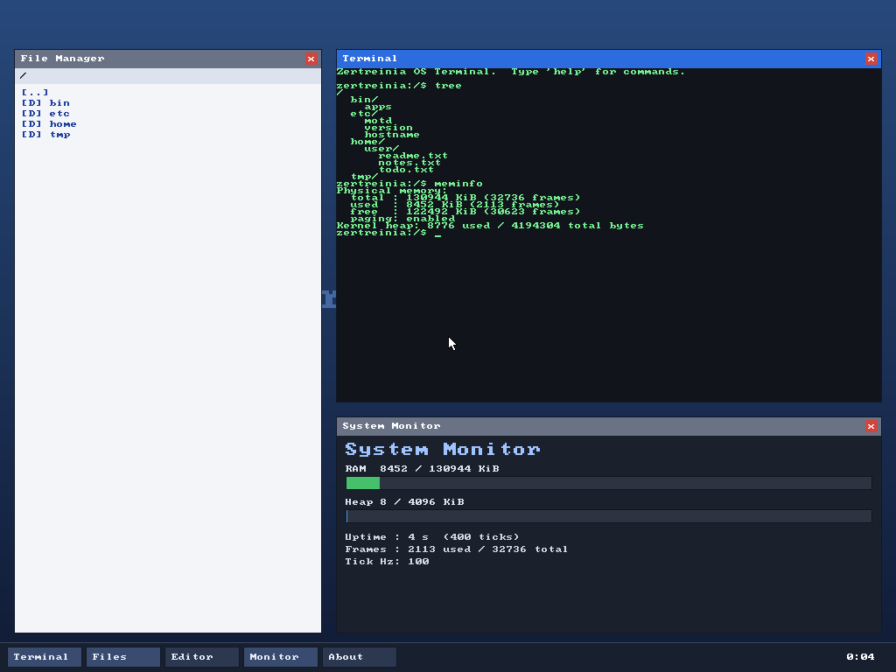

# Zertreinia OS

A small but real **32-bit x86 operating system**, written from scratch in **C**
and **Assembly (NASM)**. It boots via the Multiboot standard (GRUB), brings up a
**graphical desktop environment** with a mouse, windows and applications on top
of an **in-memory filesystem**, and runs in **VirtualBox**, QEMU and on real
hardware.

If no graphical framebuffer is available, it automatically falls back to a
fully-featured **text-mode shell**.



The desktop above shows the File Manager, a Terminal running `tree`/`meminfo`,
and a live System Monitor - all rendered by the kernel to a linear framebuffer.

---

## Features

| Subsystem            | What it does                                                        |
|----------------------|---------------------------------------------------------------------|
| **Boot**             | Multiboot v1 header (with video request), stack + BSS setup         |
| **GDT**              | Flat memory model, kernel + user code/data segments                 |
| **IDT / ISR / IRQ**  | 32 CPU-exception handlers + 16 hardware IRQs, with register dumps    |
| **PIC**              | 8259 remapped to vectors 32-47                                      |
| **PIT timer**        | 100 Hz system tick, `sleep()`, uptime                               |
| **Keyboard**         | PS/2 scancode set 1, US layout, Shift + Caps Lock, ring buffer      |
| **Mouse**            | PS/2 mouse on IRQ12, movement + buttons, on-screen cursor           |
| **Paging**           | Identity-maps low memory; 4 MiB pages map the high framebuffer      |
| **Physical memory**  | Bitmap frame allocator driven by the Multiboot memory map           |
| **Kernel heap**      | First-fit `kmalloc`/`kfree`/`kcalloc`/`krealloc` with coalescing    |
| **Graphics**         | 32-bpp linear framebuffer, double-buffered, 8x8 font, clipping      |
| **Filesystem (VFS)** | Hierarchical in-memory FS: dirs, files, paths, read/write/delete    |
| **Desktop / WM**     | Draggable windows, focus, close buttons, taskbar, clock, wallpaper  |
| **Applications**     | Terminal, File Manager, Text Editor, System Monitor, About          |
| **Text shell**       | Full command-line fallback when there is no framebuffer             |
| **Serial**           | COM1 logging (great for debugging in QEMU with `-serial stdio`)     |

### The desktop

* **Taskbar** at the bottom launches/focuses apps and shows a clock.
* **Windows** can be dragged by their title bar and closed with the red `[x]`.
* Click a window to focus it; the focused window receives keyboard input.

### Applications

| App              | What it does                                                       |
|------------------|--------------------------------------------------------------------|
| **Terminal**     | Runs the command interpreter; prints into a scrolling text grid    |
| **File Manager** | Browse the filesystem; click folders to enter, files to edit       |
| **Text Editor**  | Open a file, type, and click **Save** to write it back to the VFS  |
| **System Monitor** | Live RAM/heap usage bars, uptime, tick count, frame counts       |
| **About**        | Information about the OS                                            |

### Shell / Terminal commands

```
help              list commands          ls [path]    list a directory
clear             clear the screen       cd <path>    change directory
echo <text>       print text             pwd          print working dir
about             about this OS          cat <file>   show a file
meminfo           memory + heap stats    mkdir <name> make a directory
memtest           exercise the heap      touch <name> create a file
uptime / ticks    time since boot        write <f> <text>  write to a file
reboot / halt     stop the machine       edit <file>  open in the editor
                                         rm <name>    remove a file/dir
                                         tree         show the FS tree
```

---

## Project layout

```
Zertreinia/
├── boot/        boot.asm          Multiboot header (+video) + entry point
├── cpu/         gdt, idt, isr, timer, interrupt stubs, flush
├── drivers/     vga, serial, keyboard, mouse, gfx (framebuffer)
├── mm/          pmm (physical), paging, heap
├── fs/          vfs (in-memory filesystem)
├── libc/        string, printf/snprintf, font8x8
├── gui/         desktop (window manager), apps (the applications)
├── kernel/      kernel.c (main), shell.c (text mode), commands.c (backend)
├── include/     all public headers
├── iso/         GRUB config used to build the ISO
├── scripts/     toolchain build helper
├── linker.ld    kernel memory layout (loads at 1 MiB)
└── Makefile     build / iso / run targets
```

---

## Building

OS development uses a **freestanding cross toolchain** so the compiler never
assumes a host C library or executable format. On Windows, do everything inside
**WSL** (Ubuntu) or a Linux VM.

### 1. Install dependencies (Ubuntu / WSL / Debian)

```bash
sudo apt update
sudo apt install -y build-essential bison flex libgmp3-dev libmpc-dev \
                    libmpfr-dev texinfo nasm xorriso grub-pc-bin \
                    grub-common qemu-system-x86 mtools
```

### 2a. Quick path - build with the host compiler

If your distro ships `gcc` but not `i686-elf-gcc`, build with the host compiler
in 32-bit mode (this is exactly how the screenshot above was produced):

```bash
make USE_HOST_GCC=1 iso     # -> Zertreinia.iso
make USE_HOST_GCC=1 run     # boot it in QEMU
```

### 2b. Recommended path - the `i686-elf` cross compiler

```bash
./scripts/build-toolchain.sh
export PATH="$HOME/opt/cross/bin:$PATH"
i686-elf-gcc --version       # verify
make iso                     # -> Zertreinia.iso
```

---

## Running in VirtualBox

1. Build the ISO (`make USE_HOST_GCC=1 iso`) -> **`Zertreinia.iso`**.
2. **New** VM: Type *Other*, Version *Other/Unknown*, **128 MB** RAM, **no**
   hard disk (we boot from CD).
3. **Settings -> Storage**: attach `Zertreinia.iso` to the optical drive.
4. **Settings -> Display**: set **Graphics Controller** to **VBoxVGA** and give
   it a few MB of video memory. This exposes the legacy VESA/VBE modes that GRUB
   uses to hand us a linear framebuffer.
   *(With VMSVGA, or any VM without VBE, the OS still boots - it just starts in
   text-shell mode instead of the graphical desktop.)*
5. **Settings -> System -> Motherboard**: enable **Optical** in the boot order.
6. **Start**. GRUB appears, then the Zertreinia desktop loads.

Command-line VM creation:

```bash
VBoxManage createvm --name Zertreinia --ostype Other --register
VBoxManage modifyvm Zertreinia --memory 128 --boot1 dvd --firmware bios \
           --graphicscontroller vboxvga --vram 16
VBoxManage storagectl Zertreinia --name IDE --add ide
VBoxManage storageattach Zertreinia --storagectl IDE --port 0 --device 0 \
           --type dvddrive --medium "$(pwd)/Zertreinia.iso"
VBoxManage startvm Zertreinia
```

### Running in QEMU (fastest feedback loop)

```bash
make USE_HOST_GCC=1 run    # boots the ISO -> graphical desktop
make run                   # same, with the cross compiler
```

> Note: `make run-kernel` uses QEMU's `-kernel` Multiboot loader, which does not
> provide a framebuffer, so that path lands in the **text shell** by design.
> Use the ISO targets (`run`) to get the graphical desktop.

---

## How it boots (high level)

1. **GRUB** finds the Multiboot header (which requests a 1024x768x32 video mode)
   and loads the kernel at physical `0x00100000` (1 MiB).
2. `_start` (`boot/boot.asm`) sets up a stack, zeroes the BSS and calls
   `kernel_main(magic, multiboot_info)`.
3. `kernel_main` (`kernel/kernel.c`) brings up the GDT, IDT/PIC, timer,
   keyboard, physical allocator, paging, heap and filesystem, then enables
   interrupts.
4. If GRUB provided a 32-bpp framebuffer, the kernel maps it, initialises the
   mouse and runs the **desktop** event loop; otherwise it runs the **text
   shell**.
5. The desktop dispatches keyboard/mouse events to windows and repaints a
   double-buffered frame whenever something changes.

---

## Notes & limitations

This is a learning kernel. It runs entirely in ring 0 (kernel mode); there is no
user-space process model, pre-emptive scheduler, disk-backed filesystem or
networking yet. The architecture (GDT user segments, paging, heap, an IRQ
framework, a VFS abstraction and a windowing system) is laid out to make adding
those the natural next steps.

## License

Released into the public domain / MIT - do whatever you like with it. Have fun.
